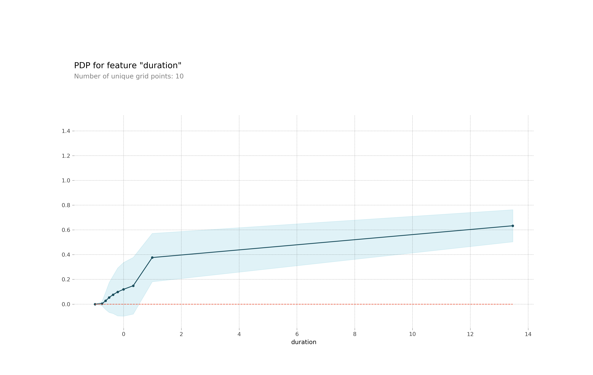

# Bank-deposit-subscription
Predict whether customers subscribe a term deposit based on 20 attributes (categorical and numerical data). 

## The data source
The source of the data was from http://archive.ics.uci.edu/ml/datasets/Bank+Marketing.  I used the data in "bank-additional-full.csv" file. The description of attributes is in "bank-additional-names.txt". 

The data was cleaned and scaled as described in *bank_deposit-subscription-data-processing.ipynb*.   The  exploratory data analysis was in notebook *bank_deposit-subscription-EDA.ipynb*.

## Balanced and unbalanced data
There are 30488 instances in the data set.  Customers didn't sign up term deposit in 26629 instances (class 0). Customers signed up term deposit in 3859 instances (*class 0: 87.35%, class 1: 12.65%*). The data is unbalanced.

Some of sikit-learn models allowed to use **class_weight='balanced'** as an input.   I also make the data more balanced by undersampling class 0 data, that randomly selected 3859 instances of class 0 and mixed with all class 1 instances.  The undersampling changed class 0 to 1 class ratio to 1. 

The undersampling and specifying class_weight='balanced' yielded similar results.    

## The binary classification of deposit subscription: 
#### Classification methods used:
    (1) SVM.SVC; 
    (2) random forest;
    (3) logistic regression;
    (4) neural network (MLPClassifier);
    (5) lightgbm

#### Model training, selection and target prediction: 
    (1) For each classification method, models were trainded with different parameter settings with 
	the training data. 
    
    (2) Optuna library was used for lightgbm hyperparameter tuning with many trials (n_trials=400, or more). The extensive trials only yield slightly better model in predictions. 

    (3) Macro average F1 scores of model predictions on test data were used to select the best setting for each classification model. Roc_auc_scores were also measured for each model.  

    (4) Models trained with unbalanced data and unbalanced data with class_weight='balanced' setting were used for comparisons.

    (5) Models trained with undersampling balanced data have similar macro average F1 and AUC scores in comparison to models trained "unbalanced data with class_weight='balanced' setting".  
    
#### One-hot-encoding:
    Most models were trained with One-hot-encoded categorical data except lightgbm which didn't allow One-hot-encoded categorical data. Random forest trained without One-hot-encoded categorical data actually performed sightly better than with One-hot-encoded data. 
	
## Model Comparison Conclusion: 

   Model comparison: see **model-comparison-summary.ipynb**
   
       (1) Random forest models, that used class_weight='balanced' or trained with the balanced data, performed better on the test data than the ones trained with unbalanced data (top 2 panels of the figure below) based on macro average F1 and AUC scores. Other models also benefit from class_weight='balanced' setting.

       (2) Random forest, neural network and lightgbm models produced very similar prediction AUC scores. The differences were miner. Random forest has the best macro average F1 on test data. Neural network also get very similar scores. Scikit learn Neural network model (MLPClassifier) doesn't have *class_weight='balanced'* setting).
   
​

​  
   
    Tick label such as *Random_forest_balanced_wt* indicated the model was trained with *class_weight='balanced'* setting as shown in the image below. In the case of lightgbm, *is_unbalanced=True* was used. Tick label such as *Random_forest_bal_data* indicated the model was trained with balanced undersampling data. 
    
​
   
​
   
	
## Model Interpretation:

    I used permutation importance, partial dependence plot (PDP) and Shap values to analyze which features of the model (Random forest) contributed most to the predictions (see *RF-unbalanced-data-one-hot-encoder-Wt_Balanced-feat-importance.ipynb*).

#### Permutation importance
    Permutation importance measure importance of the feature/column by random permutation data among rows to analyze how much the permutation affects model performance.  Features sensitive to permutation gets higher weights (see picture below). Duration and euribor3m appear to be the most importance features based on this analysis. 
​

#### Partial dependence plots (PDP)

    Partial dependence plots show how values of a feature affects predictions. I selected two most important features from the permutation importance study for the PDP.  The picture shows how feature values affect predicted probability of the deposit subscription. 

​
​

#### Shap Values

    SHAP values measure a certain value for a given feature positively or negatively contribution to the prediction in comparison to the prediction one would make if that feature took some baseline value. It can be plotted with just a single row of the data or plot for all rows of data showing overall effects. 

​
    The plot show which feature positively and negatively contributes to prediction for the single (10th) row of data.

​
    The plot summarizes overall contribution to preidction for each feature. As an example, low values of 'duration' (blue) negatively correlates prediction while high values of 'duration' (red) positively contribute to the prediction, suggesting increase of 'duration' is positively correlated to the prediction. That's consistent with PDP plot.


```python

```
